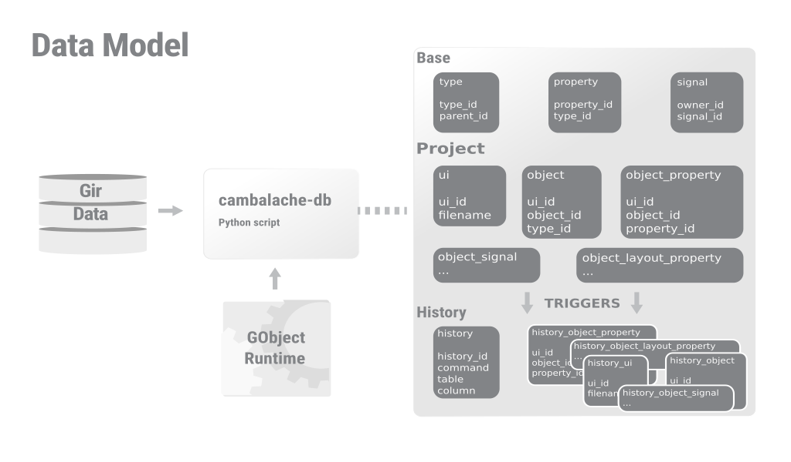

Cambalache is a new RAD tool for Gtk 4 and 3 with a clear MVC design and data model first philosophy.
This translates to a wide feature coverage with minimal/none developer intervention for basic support.



To support multiple Gtk versions it renders the workspace out of process using
the Gdk broadway backend.


## License

Cambalache is distributed under the [GNU Lesser General Public License](https://www.gnu.org/licenses/old-licenses/lgpl-2.1.en.html),
version 2.1 (LGPL) as described in the COPYING file.

Tools are distributed under the [GNU General Public License](https://www.gnu.org/licenses/gpl-2.0.en.html),
version 2 (GPL) as described in the COPYING.GPL file.

## Source code

Source code lives on GNOME gitlab [here](https://gitlab.gnome.org/jpu/cambalache)

`git clone https://gitlab.gnome.org/jpu/cambalache.git`

## Running from sources

To run it without installing use run-dev.py script, it will automatically compile
resources and create extra files needed to run.

`./run-dev.py`

The minimum requirements are Gtk 3 and lxml, Gtk 4 is only needed to have a functional Gtk 4 workspace.

## Flatpak

The preferred way to run Cambalache is using flatpak.
Instructions on how to install flatpak can be found [here](https://flatpak.org/setup/).

You can get Cambalache prebuilt bundles [here](https://gitlab.gnome.org/jpu/cambalache/-/packages).

Or build your own with the following commands
```
flatpak-builder --force-clean --repo=repo build ar.xjuan.Cambalache.json
flatpak build-bundle repo cambalache.flatpak ar.xjuan.Cambalache
flatpak install --user cambalache.flatpak
```

## Flathub Beta

Flathub is the central place for building and hosting Flatpak builds.
Cambalache is currently available on Flathub beta

To install it, use the following:
```
flatpak remote-add flathub-beta https://flathub.org/beta-repo/flathub-beta.flatpakrepo
flatpak install flathub-beta ar.xjuan.Cambalache
```

## Contributing

If you are interested in contributing you can open and issue [here](https://gitlab.gnome.org/jpu/cambalache/-/issues)
and/or a merge request [here](https://gitlab.gnome.org/jpu/cambalache/-/merge_requests)

## Financial support

You can financially support Cambalache development on Patreon [here](https://www.patreon.com/cambalache)
like all these [people](./SUPPORTERS.md) did.


## Tools

 - cambalache-db:
   Generate Data Model from Gir files

 - db-codegen:
   Generate GObject classes from DB tables
