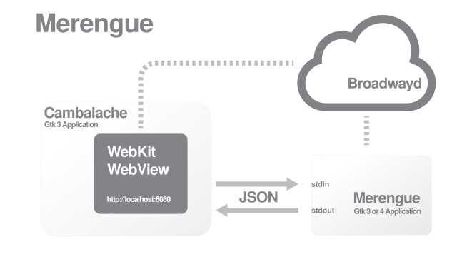

Cambalache is a new RAD tool for Gtk 4 and 3 with a clear MVC design and data model first philosophy.
This translates to a wide feature coverage with minimal/none developer intervention for basic support.


To support multiple Gtk versions it renders the workspace out of process using
the Gdk broadway backend.



## License

Cambalache is distributed under the [GNU Lesser General Public License](https://www.gnu.org/licenses/old-licenses/lgpl-2.1.en.html),
version 2.1 (LGPL) as described in the COPYING file.

Tools are distributed under the [GNU General Public License](https://www.gnu.org/licenses/gpl-2.0.en.html),
version 2 (GPL) as described in the COPYING.GPL file.

## Source code

Source code lives on GNOME gitlab [here](https://gitlab.gnome.org/jpu/cambalache)

`git clone https://gitlab.gnome.org/jpu/cambalache.git`

## Dependencies

* Python 3 - Cambalache is written in Python
* [Meson](http://mesonbuild.org) build system
* [GTK](http://www.gtk.org) 3 and 4 with broadway backend enabled
* python-gi - Python GTK bindings
* python3-lxml - Python libxml2 bindings
* WebkitGTK - Webview for workspace

## Running from sources

To run it without installing use run-dev.py script, it will automatically compile
resources and create extra files needed to run.

`./run-dev.py`

The minimum requirements are Gtk 3 and lxml, Gtk 4 is only needed to have a functional Gtk 4 workspace.

## Flatpak

The preferred way to run Cambalache is using flatpak.
Instructions on how to install flatpak can be found [here](https://flatpak.org/setup/).

Build your bundle with the following commands
```
flatpak-builder --force-clean --repo=repo build ar.xjuan.Cambalache.json
flatpak build-bundle repo cambalache.flatpak ar.xjuan.Cambalache
flatpak install --user cambalache.flatpak
```

## Flathub

You can get Cambalache prebuilt bundles [here](https://flathub.org/apps/details/ar.xjuan.Cambalache)

Use the following to install:
```
flatpak remote-add --user --if-not-exists flathub https://flathub.org/repo/flathub.flatpakrepo
flatpak install --user flathub ar.xjuan.Cambalache
```

## Manual installation

This is a regular meson package and can be installed the usual way.

```
# Create build directory and configure project
mkdir _build && cd _build
meson --prefix=~/.local

# Build and install
ninja
ninja install
```
To run it from .local/ you might need to setup PYTHONPATH env variable depending
on your distribution defaults

```
export PYTHONPATH=.local/lib/python3/dist-packages/
```

## Contributing

If you are interested in contributing you can open and issue [here](https://gitlab.gnome.org/jpu/cambalache/-/issues)
and/or a merge request [here](https://gitlab.gnome.org/jpu/cambalache/-/merge_requests)

## Contact

You can hang with us and ask us questions on Matrix at #cambalache:gnome.org

[Matrix](https://matrix.to/#/#cambalache:gnome.org)

## Financial support

You can financially support Cambalache development on Liberapay or Patreon
like all these [people](./SUPPORTERS.md) did.

[Liberapay](https://liberapay.com/xjuan)
 - Liberapay is a recurrent donations platform
 - Run by a non-profit organization
 - Source code is public
 - No commission fee
 - ~5% payment processing fee

[Patreon](https://www.patreon.com/cambalache)
 - Patreon is a membership platform for creators
 - Run by private company
 - No source code available
 - ~8% commission fee
 - ~8% payment processing fee

## Tools

 - cambalache-db:
   Generate Data Model from Gir files

 - db-codegen:
   Generate GObject classes from DB tables
